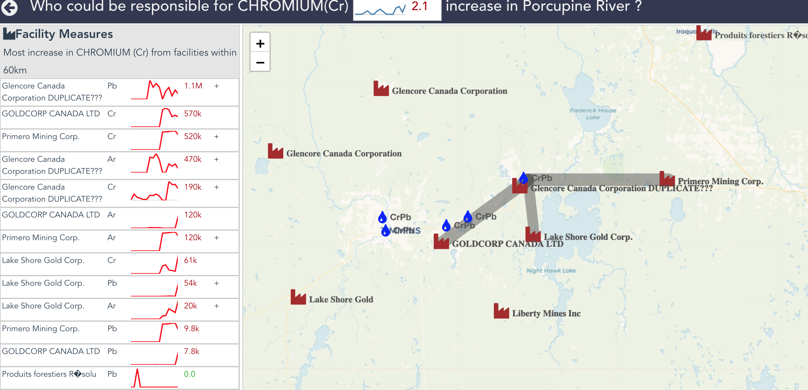

### Hackathon goal
Correlate and visualize water quality with pollutions released by industry facilities.




### Install UI Dependencies
```
npm install
```

### Run UI developlment server
```
npm run serve
```

### Run API server
```
dep ensure
go run main.go
```

### Data sources
Water quality data
- https://www.ontario.ca/data/provincial-stream-water-quality-monitoring-network

National Pollutant Release Inventory
- https://open.canada.ca/data/en/dataset/40e01423-7728-429c-ac9d-2954385ccdfb?_ga=2.201908753.1689426460.1530822302-608861113.1530822302#comments
